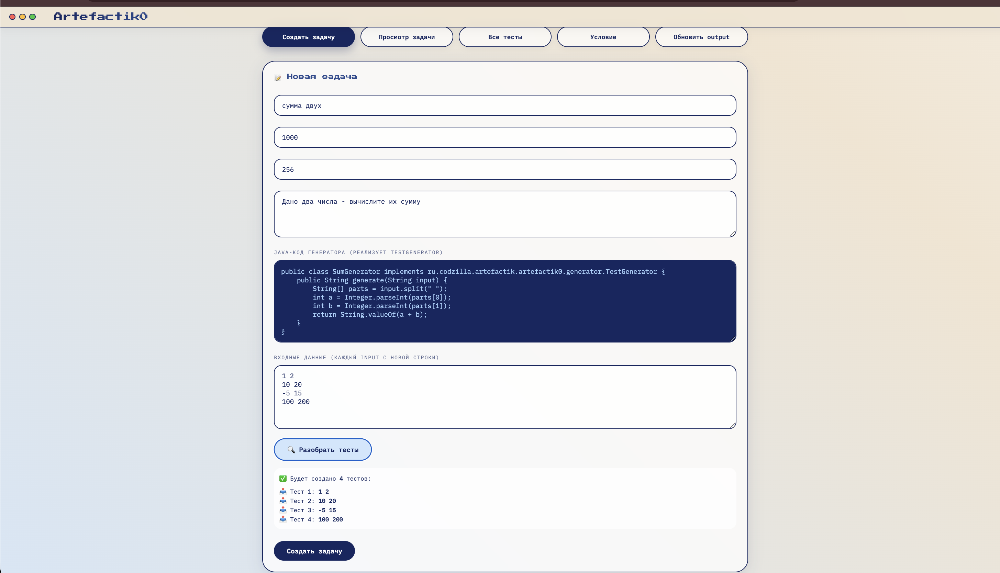
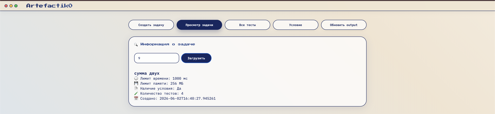
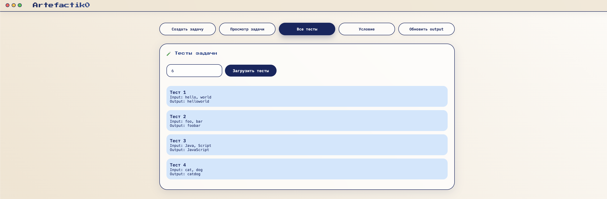
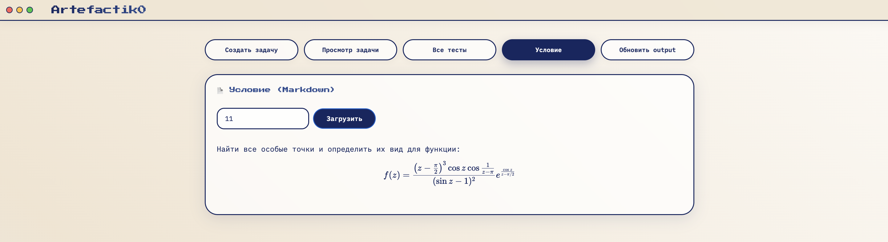

# Artefactik0 – Сервис артефактов задач 

**Artefactik0** – микросервис для хранения и генерации тестовых данных олимпиадных задач.  
Он принимает Java-код генератора и список входных данных, автоматически вычисляет правильные ответы и сохраняет всё в MinIO.  
Предназначен для работы в связке с [Judge0](https://judge0.com) (или аналогичной системой тестирования), выступая единственным источником истины для тестов и условий задач.

Основные возможности:
- Создание задачи с метаданными, Markdown-условием и генератором ответов.
- Автоматическая компиляция и выполнение генератора на лету (Java Compiler API).
- Хранение артефактов (input, output, statement, generator) в MinIO.
- UI на Thymeleaf в стиле ретро‑бенто с MacOS‑окошками.

---

## 🖼️ Скриншоты

*Здесь будут скриншоты интерфейса: создание задачи, просмотр тестов, условие с Markdown и формулами.*
#### Создание задач

#### Просмотр параметров задачи

#### Сгенерированные тесты под задачу

#### md конвертор условия

---

## 📡 API Endpoints

Все ручки доступны по адресу `http://localhost:8081/api/problems`

| Метод  | Endpoint                              | Описание                                                                                 |
|--------|---------------------------------------|------------------------------------------------------------------------------------------|
| POST   | `/api/problems`                       | Создать задачу (см. пример запроса ниже)                                                 |
| GET    | `/api/problems/{id}`                  | Получить метаданные задачи (название, лимиты, количество тестов и т.д.)                  |
| GET    | `/api/problems/{id}/tests`            | Получить все тесты задачи (input + output)                                               |
| GET    | `/api/problems/{id}/statement`        | Получить условие задачи в Markdown                                                       |
| PATCH  | `/api/problems/{id}/tests/{idx}/output` | Обновить output конкретного теста (например, после ручной проверки)                    |

Пример тела запроса на создание задачи:
```json
{
  "name": "Сумма двух чисел",
  "timeLimit": 1000,
  "memoryLimit": 256,
  "statement": "# Задача\nНайдите сумму двух целых чисел.",
  "generatorCode": "public class SumGen implements ru.codzilla.artefactik.artefactik0.generator.TestGenerator {\n    public String generate(String input) {\n        String[] parts = input.split(\" \");\n        int a = Integer.parseInt(parts[0]);\n        int b = Integer.parseInt(parts[1]);\n        return String.valueOf(a + b);\n    }\n}",
  "inputs": ["1 2", "10 20", "-5 15"]
}
```
Ответ: `200 OK` с JSON задачи.

---

## 🛠️ Требования

- **JDK 21** (или выше) – обязателен, т.к. используется Java Compiler API.
- **Docker** и **Docker Compose** – для PostgreSQL и MinIO.
- **Gradle** – для сборки проекта (wrapper включён).

---

## 🚀 Быстрый старт

### 1. Клонируйте репозиторий
```bash
git clone https://github.com/your-org/Artefactik0.git
cd Artefactik0
```

### 2. Запустите инфраструктуру (PostgreSQL + MinIO)
```bash
docker-compose up -d
```
Убедитесь, что контейнеры `artifacts-postgres` и `artifacts-minio` запущены:
```bash
docker ps
```
MinIO Console будет доступна по адресу `http://localhost:9001` (логин/пароль: `minioadmin/minioadmin`).

### 3. Настройте подключение к БД и MinIO
Отредактируйте `src/main/resources/application.properties` (или оставьте значения по умолчанию):
```properties
spring.datasource.url=jdbc:postgresql://localhost:5433/artefactik0
spring.datasource.username=myuser
spring.datasource.password=secret

minio.url=http://localhost:9000
minio.access-key=minioadmin
minio.secret-key=minioadmin
minio.bucket=artefactik0-tasks
```

### 4. Соберите и запустите приложение
```bash
./gradlew bootRun
```
Приложение стартует на порту **8081**.  
UI доступен по адресу `http://localhost:8081`.

---


## 🧪 Запуск тестов

```bash
./gradlew test
```
Тесты используют in‑memory H2 и моки для MinIO, поэтому дополнительная инфраструктура не требуется.

---
## Стэк

- Java 21
- Spring Boot 3.3
- Spring Data JPA (PostgreSQL)
- MinIO (хранение артефактов)
- Thymeleaf + HTML/CSS (UI)
- Java Compiler API (генерация output)
- Docker, Gradle

---
